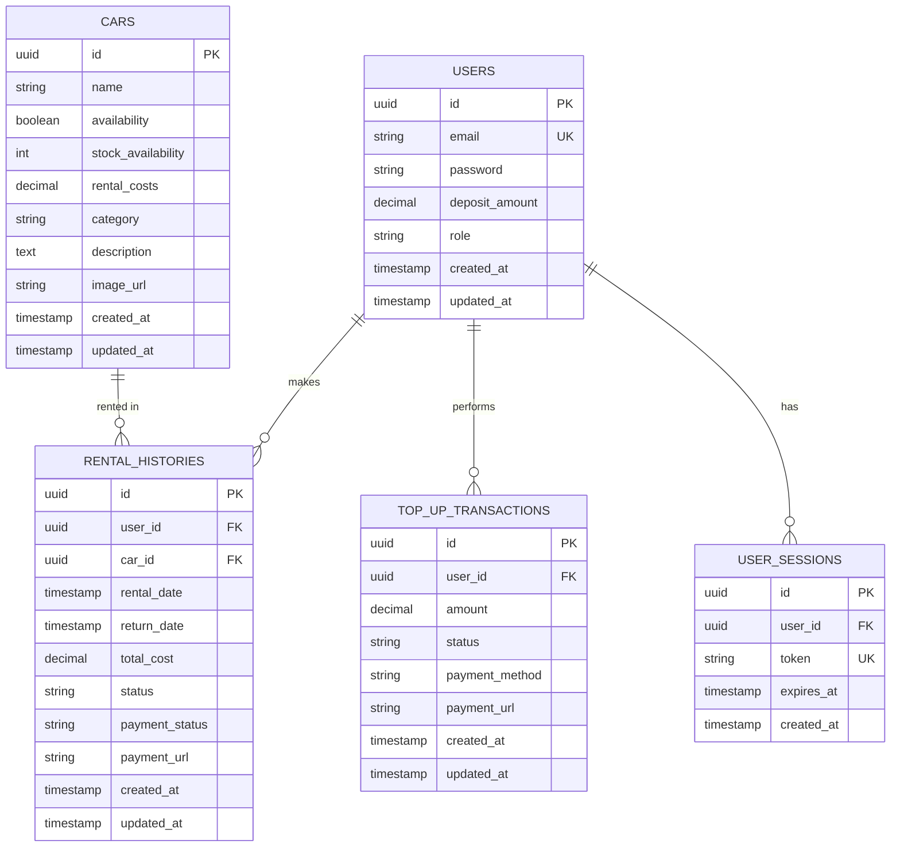

# Database Entity Relationship Diagram (ERD)

## Description of Entities

### Users
Stores user account information, including authentication credentials, current deposit balance, and roles (user/admin).

### Cars
Main entity representing the rental products. Tracks stock levels, pricing, and categories.

### Rental Histories
Tracks all car rental transactions, including the duration, cost, and payment status. Links users to the cars they rent.

### Top-Up Transactions
Records all deposit addition attempts, whether pending or completed via the payment gateway.

### User Sessions
Manages active JWT sessions and refresh tokens for secure authentication.
